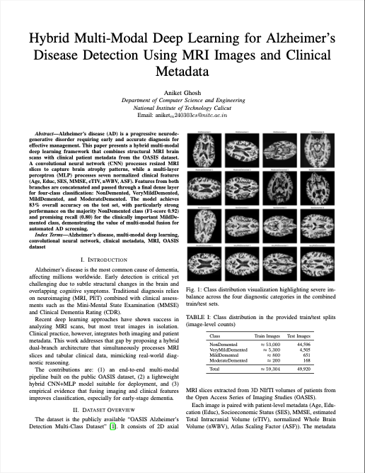

# 🧠 Hybrid Multi-Modal Deep Learning for Alzheimer's Disease Detection  
## Using MRI Images and Clinical Metadata

<p align="center">
  
</p>

**Author:** Aniket Ghosh  
**Institution:** Department of Computer Science and Engineering, National Institute of Technology Calicut  
**Email:** aniketm240303cs@nitc.ac.in  

[](https://www.kaggle.com/code/daksh4/hybrid-cnn-clinical-metadata-84)
[](https://colab.research.google.com/github/aniketghoshxdaksh-pixel/Alzheimers-Detection/blob/main/Alzheimers-Detection.ipynb)  

---

### 🚀 Project Overview

This project implements a **hybrid multi-modal deep learning framework** for 4-class Alzheimer's Disease classification using the public OASIS dataset.

- **CNN Branch**: Extracts brain atrophy patterns from 2D axial MRI slices
- **MLP Branch**: Processes 7 clinical features (`Age`, `Educ`, `SES`, `MMSE`, `eTIV`, `nWBV`, `ASF`)
- **Feature Fusion**: Concatenation → Final classifier

**Key Results**:
- Test Accuracy: **~84%**
- NonDemented F1-score: **0.93**
- MildDemented Recall: **0.80** (critical for early detection)

---

### 📊 Model Performance: Final Confusion Matrix

<p align="center">
  
</p>

*Strong NonDemented classification (38,532 correct). Solid MildDemented detection (523 TP). Minor confusion in VeryMildDemented due to class imbalance.*

---

### 🖼️ Sample MRI Slices – Disease Progression

<p align="center">
  
</p>

#### Individual Examples

<p align="center">
   &nbsp;
   &nbsp;
   &nbsp;
  
</p>

*Enlarged ventricles, widened sulci, and hippocampal atrophy increase with disease severity.*

---

### 📄 Project Report – First Page Preview

<p align="center">
  
</p>

[Download Full Report (PDF)](Report.pdf)
---

### 🛠 Technologies & Frameworks

<p align="center">
   &nbsp;
   &nbsp;
   &nbsp;
   &nbsp;
   &nbsp;
   &nbsp;
   &nbsp;
   &nbsp;
  
</p>

**Stack**: TensorFlow • Keras • NumPy • Pandas • OpenCV • Matplotlib • Seaborn • scikit-learn

---

### 📂 Repository Contents

- `Alzheimers-Detection.ipynb` → Full training & evaluation pipeline
- `Report.pdf` → Complete academic report
- Image files → Architecture, confusion matrix, MRI samples, report preview
- `README.md` → This file

---

### ⚙️ Run the Project

- **Live on Kaggle** (GPU enabled): [View & Run Notebook](https://www.kaggle.com/code/daksh4/hybrid-cnn-clinical-metadata-84)
- **Open in Colab**: Click the badge above
- **Local**: Download notebook + install requirements

```bash
pip install tensorflow keras numpy pandas matplotlib seaborn scikit-learn opencv-python tqdm
```

---

### 📜 License

MIT License – free to use and modify.

---

<p align="center">
  ⭐ <strong>Star the repo if you like it!</strong> ⭐<br>
  Contributions & feedback welcome! 🚀
</p>

*Academic Project • NIT Calicut • December 2025*


